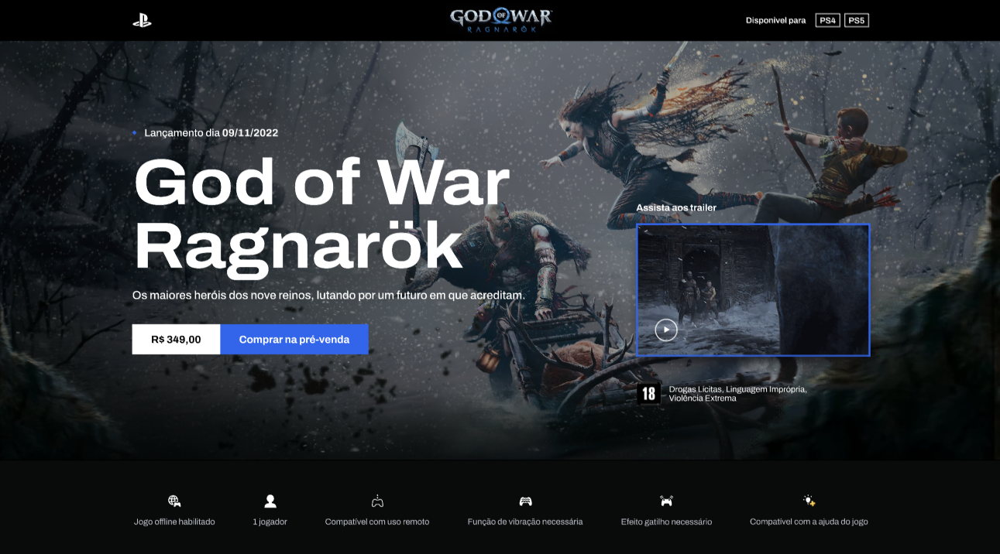

<h1 align="center"> God of War Ragnarök</h1>

Projeto desenvolvido durante o evento DEV.PROCESS oferecido pela Codeboost

  <a href="#-tecnologias">Tecnologias</a>&nbsp;&nbsp;&nbsp;|&nbsp;&nbsp;&nbsp;
  <a href="#-projeto">Projeto</a>&nbsp;&nbsp;&nbsp;|&nbsp;&nbsp;&nbsp;
  <a href="#-layout">Layout</a>&nbsp;&nbsp;&nbsp;|&nbsp;&nbsp;&nbsp;
  <a href="#memo-licença">Licença</a>

  

 

  

## 🚀 Tecnologias

Esse projeto foi desenvolvido com as seguintes tecnologias:

- HTML
- SASS
- JavaScript

## 💻 Projeto

Esse projeto apresenta uma interface do jogo God of War Ragnarök na loja da Playstation.

## 🔖 Layout

Você pode visualizar o layout do projeto através [DESSE LINK](https://www.figma.com/file/BPHOdrrzDnuvKPurADmIsW/Codeboost---God-of-War-Ragnarok?node-id=0%3A1&t=0iWcNvsXvLTQLbb5-0/duplicate). É necessário ter conta no [Figma](https://figma.com) para acessá-lo.

## :memo: Licença

Esse projeto está sob a licença MIT.

---

Feito por [Isa Kaillany](https://github.com/IsaKaillany)
